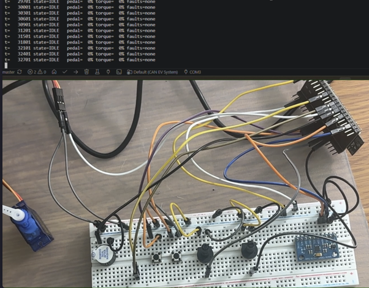
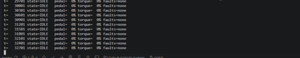
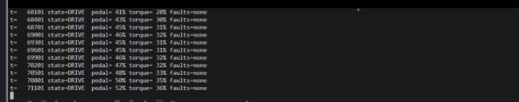
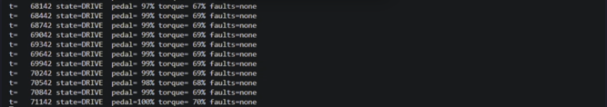
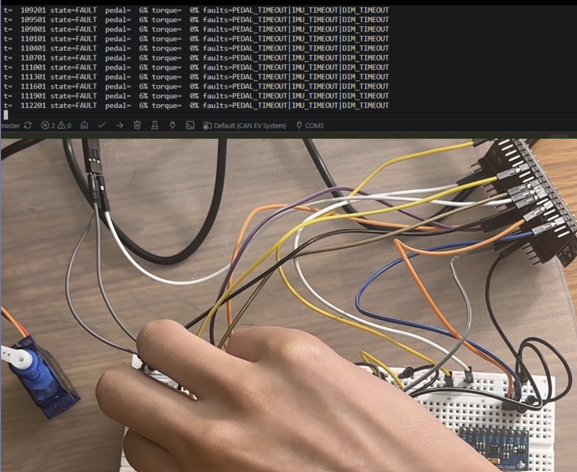
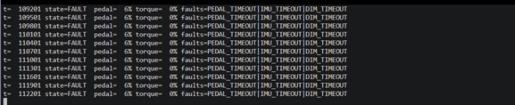
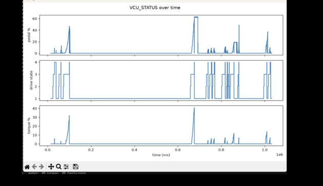

# Miniature EV Control System (ESP32, TWAI loopback)

Two-node EV control system on one ESP32: a sensor node (DIM) and a
controller node (VCU), communicating over CAN (TWAI) in self-test loopback
mode. Jumper wire from GPIO 5 (TX) to GPIO 4 (RX), no transceiver needed.

## Demo

[Watch the demo video](media/demo.mp4)

**Hardware setup:**



**Normal operation:** live decoder output, armed and idle, then torque
tracking the pedal from partial to full press.

<table>
<tr>
<td align="center" width="33%"><br><sub>IDLE, no faults</sub></td>
<td align="center" width="33%"><br><sub>DRIVE, pedal pressed</sub></td>
<td align="center" width="33%"><br><sub>DRIVE, ~100% pedal</sub></td>
</tr>
</table>

**Fail-safe proof:** pulling the CAN loopback jumper mid-drive forces a
fault and drops torque to zero, because the VCU only ever knew about the
sensor through a wire that can be cut.

<table>
<tr>
<td align="center" width="50%"><br><sub>Pulling the jumper</sub></td>
<td align="center" width="50%"><br><sub>Resulting FAULT state</sub></td>
</tr>
</table>

**Instrumentation:** pedal / drive state / torque decoded and plotted from
a captured session.



## Features

- Dual redundant pedal potentiometers, cross-checked against each other
- MPU6050 IMU with plausibility check
- Drive state machine: `BOOT` → `IDLE` → `READY` → `DRIVE` → `FAULT`
- Torque output with slew limiting
- Brake/pedal plausibility check with hysteresis
- Fault detection, latching, and persistence across reboot (NVS)
- Fails safe to zero if the CAN connection is lost
- CAN frame logging + Python decoder/plotter


## Debugging and design notes

- Single ESP32, no CAN transceiver. The two nodes only exchange data as real
  CAN frames over a physical loopback wire, no shared memory between them.
- The ESP32's CAN peripheral doesn't automatically receive its own
  transmitted frames from the TX-RX wire. Needs an explicit self-reception
  flag on every send (`msg.self = 1`).
- Button ISRs are placed in IRAM instead of flash, so they can still run
  even during an NVS (flash) write.
- IDs split `0x10x` (DIM) / `0x20x` (VCU) so the acceptance filter can
  reject the VCU's own frames with a single bitmask, not a lookup list.
- DIM ships raw ADC counts, not a calculated percentage, so the VCU sees
  the real sensor reading instead of the DIM's own conclusion.
- Every frame carries a counter and checksum, to tell apart a lost frame
  from a corrupted one.
- Dual potentiometers cross-check each other's readings.
- A time window (not an instant cutoff) decides whether a pedal mismatch
  is a real fault or just noise.
- Active faults and latched faults are separate: active is what's wrong
  right now, latched is what's ever gone seriously wrong.
- Only `DIM_TIMEOUT` latches, since a fully silent sensor node is a more
  serious failure than a momentary reading mismatch.
- Latched faults are saved to NVS, so restarting the board doesn't erase
  them.
- Fault frames are event-driven (sent on change), not broadcast every tick.
- No driver library for the MPU6050 (raw register access instead).


## Wiring

| Signal         | GPIO | Notes |
|----------------|------|-------|
| TWAI TX        | 5    | jumper to GPIO 4 |
| TWAI RX        | 4    | |
| I2C SDA        | 21   | MPU6050, 3V3 only |
| I2C SCL        | 22   | |
| Pot A (APPS1)  | 34   | ADC1 |
| Pot B (APPS2)  | 35   | ADC1 |
| Brake button   | 25   | `INPUT_PULLUP`, pressed = LOW |
| Start button   | 26   | `INPUT_PULLUP` |
| PWM torque out | 18   | servo or LED |
| Buzzer         | 19   | |
| Status LED     | 2    | |

## Folder layout

```
include/          headers
  pins.h
  can_dictionary.h
  project_config.h
  can_bus.h
  mpu6050.h
  fault_store.h
  dim.h
  vcu.h

src/
  main.cpp
  can_bus.cpp
  mpu6050.cpp
  fault_store.cpp
  dim/dim_tasks.cpp
  vcu/vcu_tasks.cpp

tools/
  decode_log.py
  requirements.txt
```

## Instrumentation

Every CAN frame is logged as one line by `canSend()`:

```
CANTX,<millis>,<id_hex>,<ok 0/1>,<byte0>,<byte1>,...,<byte7>
```

Capture and decode:

```
pip install -r tools/requirements.txt
pio device monitor > capture.txt
python tools/decode_log.py capture.txt
```

Live decoded view:

```
python tools/decode_log.py --port COM3 --live
```
