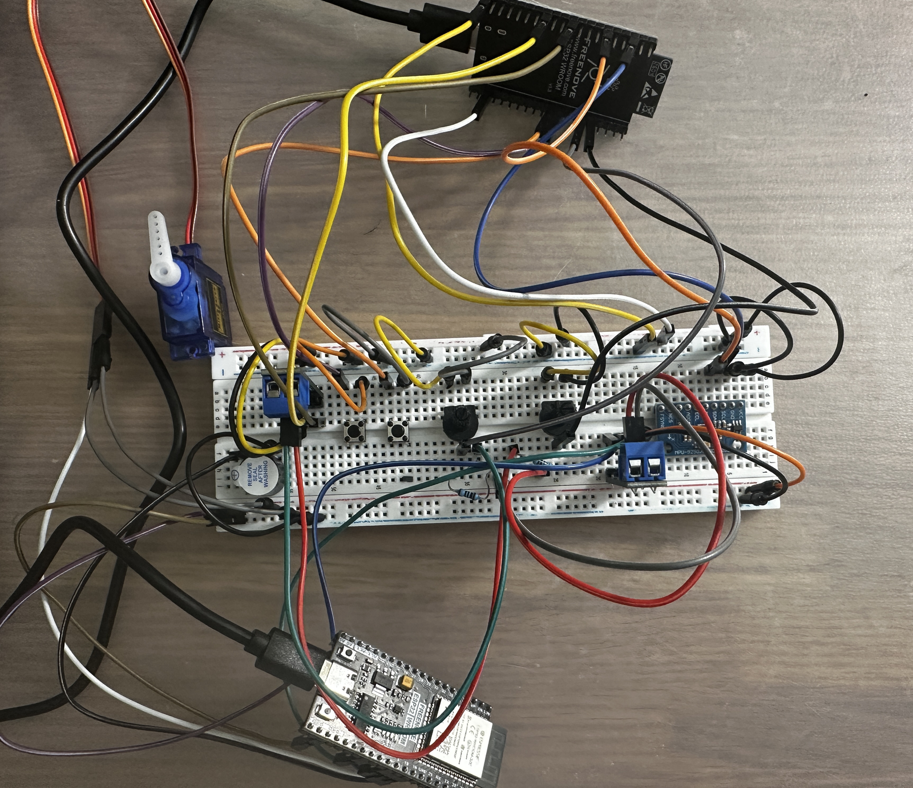
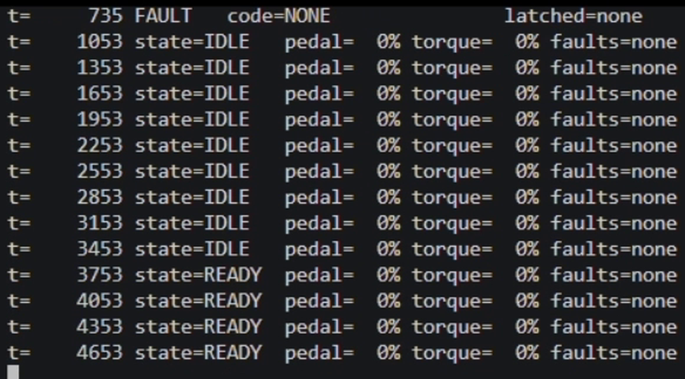
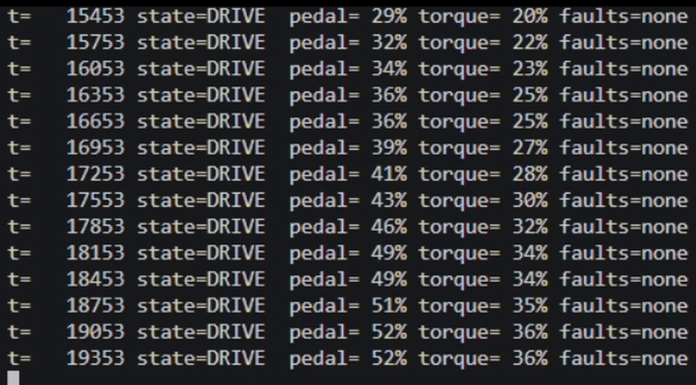
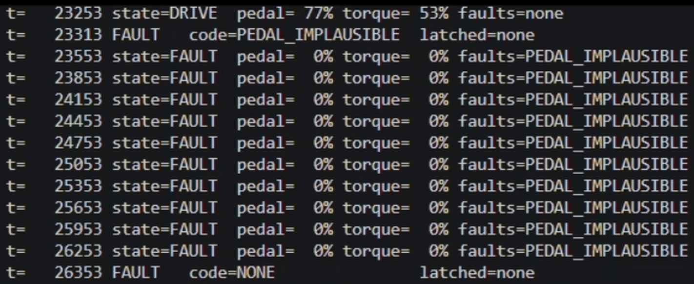
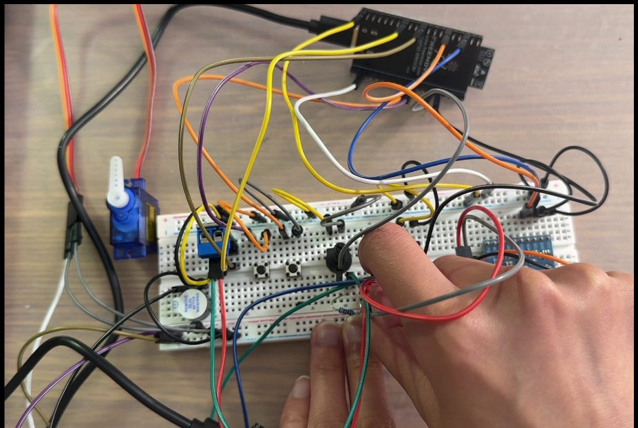
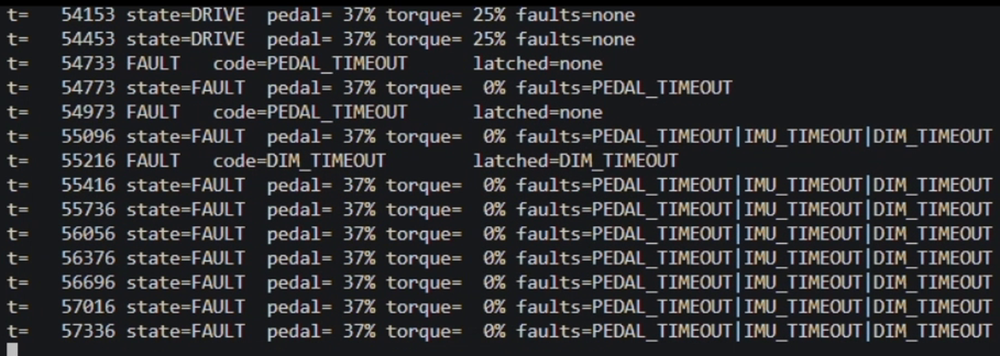

# Miniature Vehicle Control System (ESP32, TWAI CAN bus)

Two-node Vehicle control system on two ESP32 boards: a sensor node (DIM) and a
controller node (VCU), communicating over a real CAN (TWAI) bus through
3.3V CAN transceiver modules (e.g. SN65HVD230).

## Features

- Dual redundant pedal potentiometers, cross-checked against each other
- MPU6050 IMU with plausibility check
- Drive state machine: `BOOT` → `IDLE` → `READY` → `DRIVE` → `FAULT`
- Torque output with slew limiting
- Brake/pedal plausibility check: braking with the pedal past 25% cuts
  torque to zero and keeps it cut until the pedal drops below 5%
- Fault detection, latching, and persistence across reboot (NVS)
- Fails safe to zero if the CAN connection is lost
- Detects CAN bus-off (the controller disconnecting itself after too many
  transmit errors) and recovers automatically
- CAN frame logging + Python decoder/plotter

## Demo

[Watch the demo video](media/minivehicleproj.mp4)

**Hardware setup:** both nodes on one bench. Servo and buzzer on the VCU
board, pedal potentiometers, buttons and IMU on the DIM board, joined only
by the CAN bus.



**Normal operation:** live decoder output, armed and idle, then torque
tracking the pedal as it is pressed.

<sub>IDLE with no faults, then arming into READY</sub>
<br>


<sub>DRIVE, torque following the pedal at 70% and slew limited</sub>
<br>


**Pedal plausibility:** turning the two potentiometers past the tolerance
faults and zeroes torque until the two readings agree again.



**Fail-safe proof:** pulling the CAN_H line mid-drive forces a fault and
drops torque to zero, because the VCU only ever knew about the sensor
through a wire that can be cut.

<table>
<tr>
<td align="center" width="40%"><br><sub>Pulling the CAN_H line</sub></td>
<td align="center" width="60%"><br><sub>Every timeout fires, DIM_TIMEOUT latches, torque to zero</sub></td>
</tr>
</table>

**Instrumentation:** pedal / drive state / torque decoded and plotted from
a captured session.


## Debugging and design notes

### Hardware and build

- Two separate ESP32 boards, each with its own CAN transceiver. DIM and VCU
  only exchange data as real CAN frames over the bus, no shared memory
  between them.
- Each board is built from the same source with a different role flag
  (`NODE_ROLE_DIM` / `NODE_ROLE_VCU` in `platformio.ini`), so only that
  board's own peripherals and tasks get started.
- Button ISRs are placed in IRAM instead of flash, so they can still run
  even during an NVS (flash) write.
- No driver library for the MPU6050 (raw register access instead).

### CAN message design

- IDs split `0x10x` (DIM) / `0x20x` (VCU) so each board's acceptance filter
  can bitmask for the frames it cares about, and so DIM's sensor frames
  always win CAN's bus arbitration over VCU's status frames if both try to
  transmit at the same instant.
- DIM ships raw ADC counts, not a calculated percentage, so the VCU sees
  the real sensor reading instead of the DIM's own conclusion.
- Every frame carries a counter and checksum, to tell apart a lost frame
  from a corrupted one.
- Fault frames are event-driven (sent on change), not broadcast every tick.

### Fault detection and safety

- Dual potentiometers cross-check each other's readings.
- A time window (not an instant cutoff) decides whether a pedal mismatch
  is a real fault or just noise.
- Pressing the brake while the pedal is past 25% cuts torque to zero, and
  the cut latches: letting go of the brake does not give torque back, the
  pedal has to come below 5% first. Both pedals at once means something is
  wrong, so braking wins and getting torque back has to be deliberate.
  This is an override, not a fault, so the state stays `DRIVE` and no
  fault bit is set.
- Active faults and latched faults are separate: active is what's wrong
  right now, latched is what's ever gone seriously wrong.
- Only `DIM_TIMEOUT` latches, since a fully silent sensor node is a more
  serious failure than a momentary reading mismatch.
- CAN bus-off is tracked separately from `DIM_TIMEOUT`: one means VCU's own
  CAN controller failed electrically, the other just means DIM went quiet.
  Recovery is triggered once per bus-off event and never blocks the control
  loop.
- Latched faults are saved to NVS, so restarting the board doesn't erase
  them.
- Clearing a latched fault requires holding the brake and start buttons
  together for 3 seconds while in `FAULT`, a deliberate action instead of
  something that clears itself.


## Wiring

Both boards' transceivers share a CAN bus (CAN_H to CAN_H, CAN_L to CAN_L),
120Ω termination at each end.

**DIM board (sensor node):**

| Signal         | GPIO | Notes |
|----------------|------|-------|
| TWAI TX        | 5    | to transceiver TXD |
| TWAI RX        | 4    | to transceiver RXD |
| I2C SDA        | 21   | MPU6050, 3V3 only |
| I2C SCL        | 22   | |
| Pot A (APPS1)  | 34   | ADC1 |
| Pot B (APPS2)  | 35   | ADC1 |
| Brake button   | 25   | `INPUT_PULLUP`, pressed = LOW |
| Start button   | 26   | `INPUT_PULLUP` |

**VCU board (controller node):**

| Signal         | GPIO | Notes |
|----------------|------|-------|
| TWAI TX        | 5    | to transceiver TXD |
| TWAI RX        | 4    | to transceiver RXD |
| PWM torque out | 18   | servo or LED |
| Buzzer         | 19   | |
| Status LED     | 2    | |

## Folder layout

```
include/          headers
  pins.h
  can_dictionary.h
  project_config.h
  can_bus.h
  mpu6050.h
  fault_store.h
  dim.h
  vcu.h

src/
  main.cpp
  can_bus.cpp
  mpu6050.cpp
  fault_store.cpp
  dim/dim_tasks.cpp
  vcu/vcu_tasks.cpp

tools/
  decode_log.py
  requirements.txt
```

## Instrumentation

Every CAN frame is logged as one line by `canSend()`:

```
CANTX,<millis>,<id_hex>,<ok 0/1>,<byte0>,<byte1>,...,<byte7>
```

Each board only logs the frames it transmits itself, so capture each board's
serial output separately to see both sides.

Capture and decode:

```
pip install -r tools/requirements.txt
pio device monitor > capture.txt
python tools/decode_log.py capture.txt
```

Live decoded view:

```
python tools/decode_log.py --port COM3 --live
```
